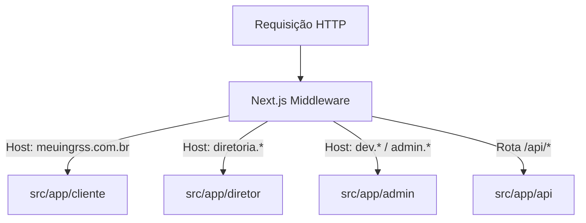

<div align="center">

# meuingrss

### Plataforma Full-Stack de Venda e Gestão de Ingressos Universitários

[-000000?style=for-the-badge&logo=nextdotjs&logoColor=white)](https://nextjs.org/)
[](https://react.dev/)
[](https://www.typescriptlang.org/)
[](https://tailwindcss.com/)
[](https://supabase.com/)
[](https://www.mercadopago.com.br/)
[](https://vitest.dev/)
[](LICENSE)

<p align="center">
  <b>Aplicação para venda e gestão de ingressos em eventos universitários.</b><br>
  Integração nativa com Mercado Pago via Pix, validação presencial de QR Code antifraude e gestão multi-lotes.
</p>


---

</div>

## Visão Geral

O **meuingrss** foi desenvolvido para transformar a gestão de festas e recepções de calouros organizadas por Atléticas Universitárias. A plataforma elimina processos manuais, filas de portaria inseguras e fraudes de ingressos duplicados através de um ecossistema integrado em portais especializados.

---

## Funcionalidades Principais

### 1. Portal do Cliente
* **Catálogo de Eventos & Atléticas:** Vitrine de eventos com busca, filtros por cidade/faculdade, mapas interativos de localização (Leaflet) e detalhes de lotes ativos.
* **Checkout Instantâneo:** Pagamentos automatizados via **Mercado Pago** (Pix com QR Code / Copia e Cola dinâmico e Cartão de Crédito).
* **Confirmação em Tempo Real:** Atualização automática de status de pagamento via Webhooks e Supabase Realtime.
* **Carteira Digital & Ingressos:** Acesso rápido aos ingressos adquiridos com QR Code criptográfico dinâmico.
* **Emissão e Download em PDF:** Geração de ingressos formatados para impressão ou acesso offline (`jspdf` + `qrcode`).

### 2. Portal da Diretoria da Atlética
* **Gestão de Eventos e Lotes:** Criação e edição de eventos, configuração de lotes progressivos (1º lote, 2º lote, etc.), limites de estoque e horários de virada de lote.
* **Scanner de Portaria Integrado:** Validador de QR Code embutido no navegador (`html5-qrcode`) que utiliza a câmera de qualquer smartphone ou tablet para leitura e check-in instantâneo sem necessidade de aplicativo nativo.
* **Métricas e Dashboards:** Monitoramento de receita em tempo real, volume de ingressos vendidos, taxa de comparecimento (check-in) e ticket médio.

### 3. Portal de Administração Geral
* **Gestão e Onboarding de Atléticas:** Aprovação e cadastro de novas atléticas parceiras.
* **Visão Financeira Consolidada:** Controle unificado de transações, taxas de serviço e repasses financeiros.
* **Auditoria do Sistema:** Monitoramento de acessos, logs operacionais e controle de papéis e permissões (RBAC).

---

## Arquitetura de Subdomínios

A aplicação utiliza o **Middleware do Next.js** para realizar o roteamento dinâmico transparente baseado no cabeçalho `Host` da requisição HTTP:

| Portal | Subdomínio Padrão | Rota Interna no App Router | Descrição |
| :--- | :--- | :--- | :--- |
| **Cliente** | `meuingrss.com.br` | `src/app/cliente` | Loja pública, catálogo, checkout e carteira |
| **Diretoria** | `diretoria.meuingrss.com.br` | `src/app/diretor` | Painel da atlética, gestão de lotes e scanner |
| **Administração** | `dev.meuingrss.com.br` | `src/app/admin` | Painel global do sistema e onboarding |



> **Nota:** Os nomes dos subdomínios são totalmente customizáveis via variáveis de ambiente (`NEXT_PUBLIC_DOMINIO_PRINCIPAL`, `NEXT_PUBLIC_SUBDOMINIO_DIRETORIA`, `NEXT_PUBLIC_SUBDOMINIO_DEV`).

---

## Segurança e Antifraude

* **QR Code com Assinatura HMAC:** Os ingressos geram tokens assinados criptograficamente para prevenir clonagem, falsificação ou reutilização após o check-in.
* **Row Level Security (RLS):** Todas as tabelas no Supabase possuem políticas estritas de isolamento de dados por usuário e nível de acesso da atlética.
* **Headers de Segurança Reforçados:** Configuração com *Content-Security-Policy* (CSP), *HTTP Strict Transport Security* (HSTS), *X-Frame-Options: DENY* e *Permissions-Policy*.
* **Proteção contra Bots:** Integração com **Cloudflare Turnstile** para proteção em rotas de checkout e autenticação.
* **Webhooks Validados:** Validação e conciliação de eventos de pagamento do gateway com idempotência e verificação de assinatura.

---

## Stack Técnica

| Camada | Tecnologias |
| :--- | :--- |
| **Frontend** | [Next.js 16 (App Router)](https://nextjs.org/), [React 19](https://react.dev/), [TypeScript](https://www.typescriptlang.org/), [Tailwind CSS v4](https://tailwindcss.com/), [Lucide React](https://lucide.dev/) |
| **Backend & Banco de Dados** | [Supabase](https://supabase.com/) (PostgreSQL, Auth, Storage, Edge Functions, Row Level Security, Realtime) |
| **Pagamentos & Gateway** | [Mercado Pago SDK](https://www.mercadopago.com.br/) (Pix dinâmico e Cartão de Crédito) |
| **Leitura & Documentos** | `html5-qrcode` (Scanner de câmera no navegador), `jspdf`, `qrcode`, `leaflet` |
| **Proteção & Bot Defense** | `@marsidev/react-turnstile` (Cloudflare Turnstile) |
| **Qualidade & Testes** | [Vitest](https://vitest.dev/), ESLint, TypeScript Strict Checking |

---

## Testes Automatizados

O projeto utiliza **Vitest** para testes de rotas, funções utilitárias e geração/validação de HMAC:

```bash
# Executar todos os testes
npm run test

# Executar testes em modo watch
npm run test:watch
```

---

## Licença

Este projeto é disponibilizado sob a licença [MIT](LICENSE).

<div align="center">
  <sub>Desenvolvido com foco em gestão de eventos das atléticas acadêmicas.</sub>
</div>
